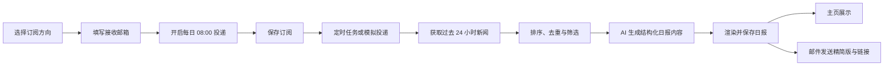
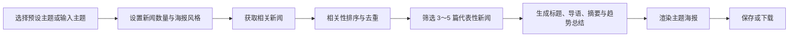
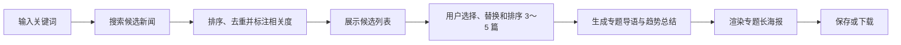

# 今日报纸 TodayPaper 产品设计文档

> 订阅你关心的方向，每天早上 8 点，世界为你排版完成。

| 项目 | 内容 |
|---|---|
| 产品名称 | 今日报纸 TodayPaper |
| 文档类型 | 产品设计文档（MVP） |
| 项目周期 | 约 2 天 |
| 团队规模 | 5 人 |
| 产品形态 | Web 应用 |
| 核心能力 | 个性化日报、主题新闻海报、关键词专题海报 |
| 默认技术栈 | Next.js、TypeScript、Tailwind CSS、shadcn/ui、Supabase、Vercel |
| 文档状态 | 可进入页面设计与开发 |

---

## 1. 产品概述

### 1.1 产品定位

今日报纸 TodayPaper 是一个基于 AI 的个性化新闻订阅、聚合与视觉化生成平台。

产品不只展示新闻，而是将分散、重复、缺少结构的信息整理为：

- 每日自动生成的个人新闻日报；
- 围绕预设主题生成的多新闻海报；
- 围绕搜索关键词生成的专题长海报。

AI 主要负责新闻摘要、栏目分类、导读与趋势总结，页面中的日报和海报由结构化数据与 HTML/CSS 模板渲染，以保证中文文字准确、版式稳定且内容可编辑。

### 1.2 用户问题

目标用户在获取新闻时通常面临以下问题：

- 信息分散在不同平台，需要反复搜索；
- 同一事件被大量转载，内容重复；
- 用户关心的主题被无关热点淹没；
- 长篇新闻阅读成本高，难以快速掌握重点；
- 收集到的新闻缺少适合保存、分享和展示的视觉形式。

### 1.3 产品价值

TodayPaper 通过“订阅—聚合—筛选—总结—排版—投递”的完整流程，为用户提供三项核心价值：

1. **节省时间**：自动收集并过滤过去 24 小时内的相关新闻。
2. **提升信息质量**：兼顾相关性、时效性、来源质量和报道角度。
3. **形成可用成果**：将新闻直接转化为日报或可下载的专题海报。

### 1.4 目标用户

#### 核心用户

- 需要持续关注 AI、科技、商业等方向的学生和年轻从业者；
- 需要为课程、社团或工作整理行业资讯的人；
- 希望每天快速了解特定领域动态的轻度新闻用户。

#### 典型使用场景

- 用户每天早上通过邮箱查看自己关注领域的新闻摘要；
- 用户准备课程分享时，生成一张“人工智能”主题资讯海报；
- 用户研究“人工智能教育”时，筛选多角度新闻并生成专题长图。

---

## 2. 产品目标与范围

### 2.1 MVP 目标

在约两天的开发周期内，完成一个可以在线部署、稳定演示且具备完整核心闭环的 MVP：

- 用户可以设置多个订阅方向；
- 系统可以生成并保存当天日报；
- 系统可以模拟每日 08:00 投递并发送邮件；
- 用户可以选择主题生成多新闻海报；
- 用户可以搜索关键词、选择新闻并生成专题海报；
- 日报和海报均可展示来源；
- 外部服务失效时仍可通过固定演示页完成展示。

### 2.2 非目标

本期不追求：

- 复杂的个性化推荐算法；
- 长期用户画像；
- 全球多时区和任意投递时间；
- 多邮箱与多语言；
- 自动发布至社交媒体；
- AI 直接生成包含大量中文文字的整张海报；
- 邮件 PDF 附件；
- 大规模高并发生产能力。

### 2.3 成功标准

#### 产品成功标准

- 三个核心功能均可从首页进入并完成闭环；
- 用户能在 3～5 分钟内理解产品价值；
- 生成结果具有清晰的信息层级和报纸/海报质感；
- 所有新闻内容均展示来源、发布时间和原文入口。

#### 演示成功标准

- “模拟每日 8 点投递”可在现场立即生成日报；
- 同一用户同一天重复触发时不会生成多份日报；
- 至少准备三套稳定案例：
  - 每日订阅：AI、科技、商业；
  - 主题海报：人工智能；
  - 关键词专题：人工智能教育；
- 新闻 API、AI API 或邮件服务异常时，固定数据仍能完成主流程演示。

---

## 3. 产品信息架构

```text
产品首页
├── 每日订阅日报
│   ├── 首次订阅设置
│   ├── 用户主页 / 日报收件箱
│   ├── 日报详情
│   └── 订阅管理
├── 选择主题生成海报
│   ├── 主题与参数设置
│   └── 主题海报预览
├── 搜索关键词生成专题海报
│   ├── 关键词搜索
│   ├── 候选新闻选择与排序
│   └── 专题海报预览
├── 历史作品
└── 固定演示页
    ├── /demo/home
    ├── /demo/newspaper
    ├── /demo/theme-poster
    └── /demo/topic-poster
```

---

## 4. 核心用户流程

### 4.1 每日订阅日报



### 4.2 选择主题生成海报



### 4.3 搜索关键词生成专题海报



---

## 5. 核心功能设计

### 5.1 每日订阅日报

#### 功能说明

用户设置一个或多个长期关注方向，系统每天 08:00 聚合过去 24 小时的相关新闻，筛选并生成个人日报，将日报保存到主页，并通过邮件发送精简内容和完整日报链接。

#### 用户输入

- 订阅方向：可多选；
- 自定义关键词：可选；
- 接收邮箱；
- 是否开启每日投递；
- 默认投递时间：08:00。

#### 预设订阅方向

- 人工智能
- 科技数码
- 商业财经
- 体育赛事
- 电影娱乐
- 校园生活
- 区块链
- 大学生就业

#### 系统处理

1. 读取已启用订阅；
2. 获取过去 24 小时相关新闻；
3. 统一不同数据源的字段格式；
4. 按相关性、时效性和来源质量排序；
5. 对标题和摘要进行相似度去重；
6. 为每个栏目保留 2～3 篇代表性新闻；
7. 从全部内容中选出今日头条；
8. 生成 AI 今日导读、速览和后续关注点；
9. 生成结构化日报 JSON；
10. 使用日报模板渲染；
11. 保存至用户主页；
12. 发送邮件并记录投递结果。

#### 防重复规则

`user_id + issue_date` 必须建立唯一约束。

- 首次触发：创建并生成日报；
- 生成中再次触发：返回“今日内容正在生成”；
- 已生成后再次触发：直接返回现有日报；
- 生成失败后重试：更新原记录，不创建重复期数。

#### 日报内容结构

1. **报头**
   - 产品名称；
   - 日期与期号；
   - 用户订阅方向；
   - 生成时间。
2. **今日头条**
   - 主标题、主图；
   - AI 摘要和核心要点；
   - 来源、时间和原文入口。
3. **AI 今日导读**
   - 今日主要事件；
   - 新闻之间的联系；
   - 当前趋势；
   - 值得继续观察的问题。
4. **分栏目新闻**
   - 每个订阅方向形成独立栏目；
   - 每栏展示 2～3 篇新闻。
5. **今日速览**
   - 若干条一句话新闻。
6. **值得继续关注**
   - 后续可能发展；
   - 当前争议；
   - 推荐关注关键词。
7. **来源区**
   - 汇总来源、发布时间与原文链接。

#### 验收标准

- 可以保存至少三个订阅方向；
- 可以手动触发日报生成；
- 可以通过模拟按钮完成生成、保存和邮件投递；
- 同一用户当天重复触发只存在一份日报；
- 日报至少包含头条、导读、栏目、速览、关注点和来源；
- AI 失败时仍能用原始新闻描述或固定内容生成日报；
- 邮件失败不影响主页中的日报保存。

---

### 5.2 选择主题生成海报

#### 功能说明

用户从预设主题中选择一个方向，或输入自定义主题。系统筛选 3～5 篇代表性新闻，生成一张多新闻资讯海报。

#### 预设主题

- AI 前沿
- 科技数码
- 商业财经
- 体育赛事
- 电影娱乐
- 校园生活
- 健康生活

#### 可配置项

- 主题；
- 新闻数量：3～5 篇；
- 摘要长度：精简 / 标准；
- 海报风格：MVP 默认“经典报刊”；
- 是否显示二维码：可选。

#### 海报内容

- 主题总标题；
- 专题导语；
- 3～5 篇代表性新闻；
- 每篇新闻的精简标题和摘要；
- 来源和发布时间；
- AI 趋势总结；
- 核心关键词；
- 产品标识或二维码。

#### 交互规则

- 未选择主题时，“生成海报”按钮不可用；
- 生成过程中显示分步骤进度；
- 新闻不足 3 篇时提示用户扩大时间范围或使用演示数据；
- 生成成功后进入预览页；
- 用户可以保存作品或下载长图；
- MVP 阶段不要求用户逐篇编辑主题海报内容。

#### 验收标准

- 可选择预设主题，也可输入自定义主题；
- 每张海报包含 3～5 篇新闻，而非单篇新闻；
- 新闻之间没有明显重复；
- 海报包含导语、趋势总结和来源；
- 海报可预览，下载功能至少在一种主流桌面浏览器中可用；
- 外部服务异常时可以生成固定“人工智能”主题海报。

---

### 5.3 搜索关键词生成专题海报

#### 功能说明

用户输入具体关键词后，系统搜索候选新闻并计算相关度。用户可以从候选结果中选择、替换或排序 3～5 篇报道，再生成多角度专题长海报。

#### 搜索参数

- 搜索关键词：必填；
- 时间范围：过去 24 小时 / 过去 7 天 / 过去 30 天；
- 新闻数量：默认 4 篇，范围 3～5 篇。

#### 综合排序

```text
综合分数 =
关键词相关度 × 50%
+ 时效性 × 20%
+ 来源质量 × 15%
+ 内容完整度 × 15%
```

排序完成后，继续执行：

- 标题相似度去重；
- 摘要相似度去重；
- 同源转载过滤；
- 报道角度多样性筛选。

#### 角度多样性

系统优先选择不同报道角度，例如：

- 政策；
- 技术；
- 产业；
- 应用；
- 市场或投资。

若候选新闻角度高度一致，应降低重复内容优先级，而不是直接选择综合分数最高的前五篇。

#### 候选新闻交互

每张候选新闻卡片显示：

- 标题；
- 简短描述；
- 来源与发布时间；
- 相关性分数；
- 推测报道角度；
- 选择状态。

用户可以：

- 取消已选新闻；
- 选择其他候选新闻；
- 调整已选新闻顺序；
- 查看当前选择数量；
- 在满足 3～5 篇时生成专题。

#### 验收标准

- 空关键词不能发起搜索；
- 搜索结果展示相关性分数；
- 默认推荐 3～5 篇新闻；
- 用户可以取消、替换和排序；
- 少于 3 篇或多于 5 篇时不能生成；
- 最终专题包含导语、文章摘要、趋势总结、关键词和来源；
- 固定演示数据可完成“人工智能教育”案例。

---

## 6. 页面设计

### 6.1 产品首页

#### 页面目标

让首次访问者在 10 秒内理解产品，并选择一个核心功能开始体验。

#### 页面结构

1. 顶部导航：Logo、产品功能、历史作品、进入主页；
2. 首屏：
   - 产品名称；
   - 宣传语；
   - 简短价值说明；
   - “设置我的日报”主按钮；
3. 三个功能入口卡片：
   - 每日订阅日报；
   - 主题新闻海报；
   - 关键词专题海报；
4. 报纸或海报效果预览；
5. “订阅—筛选—生成—投递”流程说明；
6. 页脚与数据来源说明。

#### 关键状态

- 未登录：引导体验或进入演示页；
- 已登录且未设置订阅：突出首次设置；
- 已登录且已有今日日报：突出“查看今日报纸”。

---

### 6.2 首次订阅设置页

#### 页面结构

- 步骤提示；
- 订阅方向多选卡片；
- 自定义关键词输入；
- 邮箱输入；
- 每日投递开关；
- 固定投递时间 08:00；
- 保存按钮。

#### 校验规则

- 至少选择一个预设方向或填写一个自定义关键词；
- 邮件投递开启时，邮箱必须合法；
- 自定义关键词去除首尾空格，禁止重复添加；
- 保存成功后跳转用户主页。

---

### 6.3 用户主页 / 日报收件箱

#### 页面目标

营造“日报已经按时送达”的收件箱体验。

#### 页面结构

- 问候语与投递状态；
- “今天早上 8 点，系统已为你送来一份日报”提示；
- 今日份日报大卡片；
- 今日头条与 AI 导读预览；
- 当前订阅方向；
- 下一次投递时间；
- “模拟每日 8 点投递”演示按钮；
- 历史日报；
- 管理订阅入口。

#### 状态设计

| 状态 | 页面表现 |
|---|---|
| 今日未生成 | 显示下一次投递时间和手动模拟按钮 |
| 正在生成 | 显示步骤进度，禁用重复触发 |
| 已生成 | 展示日报封面、导读和查看详情按钮 |
| 生成失败 | 显示重试按钮，并说明将使用降级数据 |
| 无订阅 | 引导前往订阅设置 |

---

### 6.4 日报详情页

#### 页面目标

用具有真实报纸质感的排版完整呈现当日新闻。

#### 经典日报模板

- 桌面端使用多栏排版；
- 移动端转换为单栏阅读；
- 报头使用高辨识度衬线字体；
- 正文优先保证可读性，不追求过度装饰；
- 今日头条占据首屏视觉中心；
- 栏目间使用细线、留白和编号形成层级；
- 来源链接始终可见。

#### 页面操作

- 返回主页；
- 查看原文；
- 分享链接；
- 下载或打印（P1）。

---

### 6.5 主题海报生成页

#### 页面布局

- 左侧或顶部：主题与参数设置；
- 中间：生成进度；
- 右侧或下方：海报预览；
- 底部：重新生成、保存、下载。

#### 生成进度文案

1. 正在搜索相关新闻；
2. 正在筛选代表性内容；
3. 正在生成专题摘要；
4. 正在完成海报排版。

---

### 6.6 关键词搜索页

#### 页面结构

- 搜索框；
- 时间范围；
- 搜索按钮；
- 候选新闻列表；
- 已选新闻栏；
- 数量提示；
- 拖拽或按钮排序；
- “生成专题海报”按钮。

#### 交互重点

- 默认选择系统推荐的 4 篇新闻；
- 候选卡片清楚显示“已选/未选”；
- 调整新闻后实时更新已选数量；
- 用户无需理解算法，但可以看到相关性分数和报道角度。

---

### 6.7 专题海报页

#### 页面结构

- 专题封面；
- 专题标题和导语；
- 3～5 篇新闻内容；
- 每篇新闻角度标签；
- 趋势总结；
- 关键结论；
- 核心关键词；
- 来源区；
- 保存和下载操作。

---

### 6.8 订阅管理页

支持：

- 添加订阅；
- 添加自定义关键词；
- 暂停或恢复单个订阅；
- 删除订阅；
- 修改接收邮箱；
- 开启或关闭每日投递。

删除订阅时需要二次确认；暂停订阅不删除历史日报。

---

### 6.9 历史作品页

统一展示：

- 历史日报；
- 主题海报；
- 关键词专题海报。

MVP 可使用标签页或筛选按钮区分作品类型。卡片至少显示标题、日期、类型和查看入口。

---

### 6.10 固定演示页

| 路由 | 内容 |
|---|---|
| `/demo/home` | 已收到今日日报的用户主页 |
| `/demo/newspaper` | AI、科技、商业个性化日报 |
| `/demo/theme-poster` | “人工智能”主题海报 |
| `/demo/topic-poster` | “人工智能教育”关键词专题海报 |

固定演示页使用本地 JSON 和本地图片，不依赖登录、数据库、新闻 API、AI API 或邮件服务。

---

## 7. 视觉与内容设计规范

### 7.1 视觉关键词

- 报纸感；
- 编辑精选；
- 清晰可信；
- 现代但不过度科技化；
- 适合阅读、保存和分享。

### 7.2 建议视觉方向

- 主色：墨黑或深灰；
- 纸张背景：暖白；
- 强调色：报纸红；
- 标题：具有编辑感的中文衬线字体；
- 正文：清晰的中文无衬线字体；
- 图片比例统一，避免布局跳动；
- 使用细分隔线、编号和留白建立信息层级。

### 7.3 内容规则

- 不虚构新闻事实、来源、时间或原文链接；
- AI 摘要不得加入原文没有的信息；
- 标题可以精简，但不能改变新闻原意；
- 所有 AI 生成总结应使用“趋势观察”而非确定性预测；
- 新闻来源和发布时间必须始终展示；
- AI 生成失败时优先使用原始 `description`；
- 内容缺失时隐藏对应模块，不显示空白占位。

---

## 8. 页面与系统状态

所有核心页面至少覆盖以下状态：

| 状态 | 设计要求 |
|---|---|
| 初始状态 | 明确下一步操作 |
| 加载状态 | 显示当前处理阶段，不只展示无限转圈 |
| 空状态 | 解释为什么为空，并提供行动入口 |
| 成功状态 | 突出生成结果与下一步操作 |
| 部分成功 | 例如日报已保存但邮件失败，分别反馈 |
| 错误状态 | 使用用户可理解的语言，提供重试或演示数据入口 |
| 离线演示 | 不请求外部接口，始终可访问 |

---

## 9. 数据与接口约定

### 9.1 核心数据类型

```ts
interface NewsArticle {
  id: string;
  title: string;
  description: string;
  content?: string;
  source: string;
  sourceUrl?: string;
  publishedAt: string;
  category: string;
  imageUrl?: string;
  keywords: string[];
  relevanceScore?: number;
}

interface DailyIssue {
  id: string;
  userId: string;
  issueDate: string;
  newspaperName: string;
  topics: string[];
  leadArticleId: string;
  dailyBriefing: string;
  sections: {
    title: string;
    articles: NewsArticle[];
  }[];
  quickNews: string[];
  watchNext: string[];
  createdAt: string;
}

interface TopicPosterContent {
  id: string;
  keyword: string;
  topicTitle: string;
  introduction: string;
  articles: {
    id: string;
    headline: string;
    summary: string;
    angle: string;
    source: string;
    sourceUrl?: string;
    publishedAt: string;
    imageUrl?: string;
    relevanceScore: number;
  }[];
  trendSummary: string;
  keyTakeaways: string[];
  keywords: string[];
  template: string;
  createdAt: string;
}
```

开发开始后应尽量冻结以上字段。新增字段优先使用可选属性，避免同时修改多个模块。

### 9.2 主要接口

| 方法 | 路径 | 用途 |
|---|---|---|
| GET | `/api/news/search` | 搜索候选新闻 |
| POST | `/api/news/rank` | 新闻排序与去重 |
| POST | `/api/daily-issue/generate` | 生成日报 |
| POST | `/api/theme-poster/generate` | 生成主题海报 |
| POST | `/api/topic-poster/generate` | 生成关键词专题海报 |
| GET/POST | `/api/subscriptions` | 查询或创建订阅 |
| PATCH/DELETE | `/api/subscriptions/:id` | 修改或删除订阅 |
| POST | `/api/cron/daily-delivery` | 每日自动投递 |
| POST | `/api/delivery/simulate` | 现场模拟投递 |
| POST | `/api/email/send` | 发送日报邮件 |
| GET | `/api/daily-issues` | 查询历史日报 |
| GET | `/api/creations` | 查询历史作品 |

### 9.3 主要数据表

- `users`
- `subscriptions`
- `delivery_settings`
- `daily_issues`
- `topic_posters`
- `search_history`
- `delivery_logs`

`daily_issues` 需要对 `(user_id, issue_date)` 建立唯一约束。

---

## 10. 异常处理与降级策略

| 异常 | 降级方案 |
|---|---|
| 新闻 API 不可用 | 使用缓存数据或本地演示 JSON |
| 候选新闻数量不足 | 扩大时间范围，仍不足时提示并使用固定数据 |
| AI API 不可用 | 使用原始标题、描述和预设栏目文案 |
| AI 返回格式错误 | 尝试结构修复；失败则使用非 AI 内容 |
| 图片加载失败 | 使用本地默认报纸占位图 |
| 邮件发送失败 | 日报照常保存，记录失败日志并允许重试 |
| 数据库写入失败 | 保留当前页面结果并提示用户下载，避免成果丢失 |
| 海报导出失败 | 保留在线预览并提示重新下载 |
| 定时任务重复触发 | 通过唯一约束返回当天已有日报 |

---

## 11. 优先级规划

### 11.1 P0：必须完成

- 多订阅方向的选择与保存；
- 手动触发生成日报；
- 每日定时任务；
- 日报保存到主页；
- 邮件投递；
- 一套完整日报模板；
- 选择主题生成多新闻海报；
- 搜索关键词生成多新闻专题海报；
- 一套完整专题海报模板；
- 新闻相关性排序和基础去重；
- 在线部署；
- 固定演示页。

### 11.2 P1：有余力完成

- 暂停和恢复订阅；
- 自定义订阅关键词；
- 历史日报与历史海报；
- 第二套报纸或海报模板；
- 手动调整新闻顺序；
- 海报下载；
- 邮件投递日志。

### 11.3 P2：本期不做

- 全球多时区；
- 多邮箱；
- 任意投递时间；
- 复杂推荐算法；
- 长期行为画像；
- 自动发布社交媒体；
- AI 生成完整文字海报图片；
- 多语言日报；
- 邮件 PDF 附件。

---

## 12. 两天开发建议

### Day 1：完成数据闭环与核心页面

#### 上午

- 初始化仓库、分支、项目目录和部署环境；
- 冻结核心 TypeScript 类型；
- 准备三套固定演示数据；
- 搭建数据库表和基础登录；
- 完成首页与核心页面骨架。

#### 下午

- 接入新闻搜索或 RSS；
- 完成统一数据格式、基础排序和去重；
- 完成日报生成接口；
- 完成主题海报与关键词专题生成接口；
- 完成经典日报模板与专题海报模板。

#### 晚上

- 串联订阅设置、用户主页与日报详情；
- 串联主题海报流程；
- 串联关键词搜索和新闻选择流程；
- 部署首个可访问版本。

### Day 2：完成投递、容错与演示

#### 上午

- 接入 Supabase 保存；
- 完成定时任务与模拟投递；
- 接入邮件服务；
- 完成防重复约束和投递日志。

#### 下午

- 完成固定演示路由；
- 补齐加载、空、错误和降级状态；
- 完成响应式适配；
- 完成海报导出；
- 执行核心流程验收。

#### 晚上

- 修复 P0 Bug；
- 冻结演示版本；
- 准备 PPT、讲稿、二维码和演示视频；
- 在断网或外部服务失效条件下进行一次完整彩排。

---

## 13. 五人协作边界

| 角色 | 主要交付 |
|---|---|
| 1 号：前端与视觉渲染 | 页面、日报/海报模板、响应式、图片导出、页面状态 |
| 2 号：后端与 AI | 新闻获取、排序去重、结构化生成、演示数据与降级 |
| 3 号：数据库与部署 | Supabase、登录、定时任务、邮件、日志、Vercel |
| 4 号：产品与测试 | 产品规则、内容规则、测试数据、测试用例、Bug 与验收 |
| 5 号：UI 与展示 | Logo、视觉规范、设计参考、邮件模板、PPT、讲稿、演示组织 |

### 协作接口

- 1 号与 2 号以三个核心 TypeScript 类型作为前后端契约；
- 2 号向 1 号提供真实接口和同结构 Mock JSON；
- 3 号与 2 号共同确定生成、保存和投递状态；
- 4 号在每个 P0 功能合并前按验收标准测试；
- 5 号优先交付颜色、字体、Logo 和模板参考，避免前端后期返工。

---

## 14. 测试与验收清单

### 14.1 每日订阅

- [ ] 可以选择并保存 AI、科技、商业三个方向；
- [ ] 关闭邮件投递时可以不填写邮箱；
- [ ] 点击模拟投递后出现明确进度；
- [ ] 日报成功保存到主页；
- [ ] 邮箱收到精简版日报和完整链接；
- [ ] 当天重复点击不会产生第二份日报；
- [ ] 日报详情包含完整来源信息；
- [ ] AI 失败时仍可生成可读日报。

### 14.2 主题海报

- [ ] 可以选择“人工智能”；
- [ ] 生成内容包含 3～5 篇新闻；
- [ ] 新闻无明显重复；
- [ ] 海报包含导语、摘要、趋势与来源；
- [ ] 可以保存或下载；
- [ ] 固定演示页无需外部服务即可打开。

### 14.3 关键词专题

- [ ] 搜索“人工智能教育”可展示候选新闻；
- [ ] 候选内容展示相关度和报道角度；
- [ ] 默认推荐 3～5 篇；
- [ ] 可以取消、替换和排序；
- [ ] 数量不合法时禁止生成；
- [ ] 生成结果包含多个不同报道角度；
- [ ] 长海报可正常预览。

### 14.4 通用验收

- [ ] 三个核心功能都能从首页进入；
- [ ] 手机和电脑端均能正常浏览；
- [ ] 所有异步操作均有加载状态；
- [ ] 所有空状态均提供下一步入口；
- [ ] 外部接口失败时有用户可理解的反馈；
- [ ] 生产环境链接和二维码可访问；
- [ ] 3～5 分钟演示流程至少彩排两次。

---

## 15. 现场演示脚本

### 第一部分：每日订阅

```text
选择 AI、科技、商业
→ 保存每天 08:00 投递
→ 点击“模拟每日 8 点”
→ 主页出现今日报纸
→ 展示邮件投递结果
→ 打开完整日报
```

讲解重点：TodayPaper 会自动完成收集、去重、摘要、排版与投递，用户不打开网站也能收到日报。

### 第二部分：主题海报

```text
选择“人工智能”
→ 展示系统筛选多篇新闻
→ 生成主题海报
→ 展示导语、趋势、来源和下载结果
```

讲解重点：海报聚合多篇同主题新闻，不是单篇文章的视觉包装。

### 第三部分：关键词专题

```text
搜索“人工智能教育”
→ 展示候选新闻、相关度和报道角度
→ 调整并选择 4 篇新闻
→ 生成专题导语和趋势总结
→ 展示专题长海报
```

讲解重点：系统不仅按分数选新闻，还兼顾政策、技术、产业和应用等不同角度。

---

## 16. 待确认事项

以下事项不影响项目启动，但应在 Day 1 上午确定：

- 产品最终 Logo、主色和字体；
- 新闻数据源及其调用限制；
- LLM API 的可用模型与结构化输出方式；
- 演示账号和接收邮件地址；
- 海报下载采用前端截图还是服务端生成；
- P1 功能中哪些可以在完成 P0 后继续实现。

---

## 17. 版本结论

TodayPaper 的 MVP 以三个核心功能为不可删减范围：

1. 每日订阅日报；
2. 选择主题生成多新闻海报；
3. 搜索关键词生成多新闻专题海报。

项目设计应始终围绕“真实可用的新闻内容、稳定的结构化生成、清晰的视觉呈现和可靠的现场演示”展开。在两天开发周期内，优先保证完整闭环和演示稳定性，再增加模板数量或高级个性化能力。
